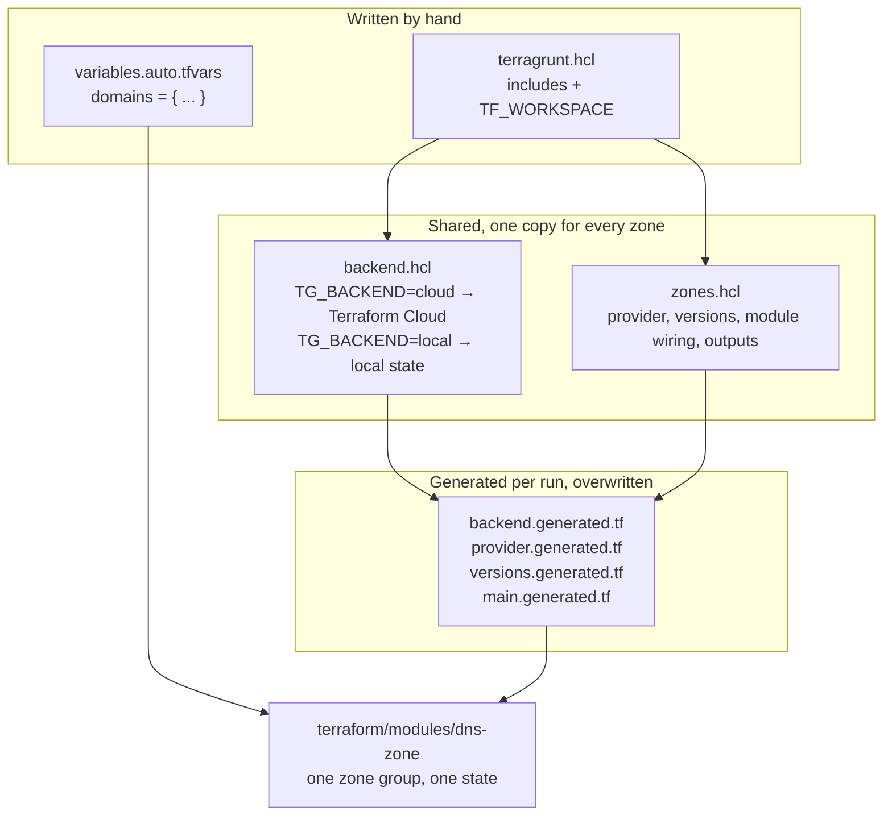
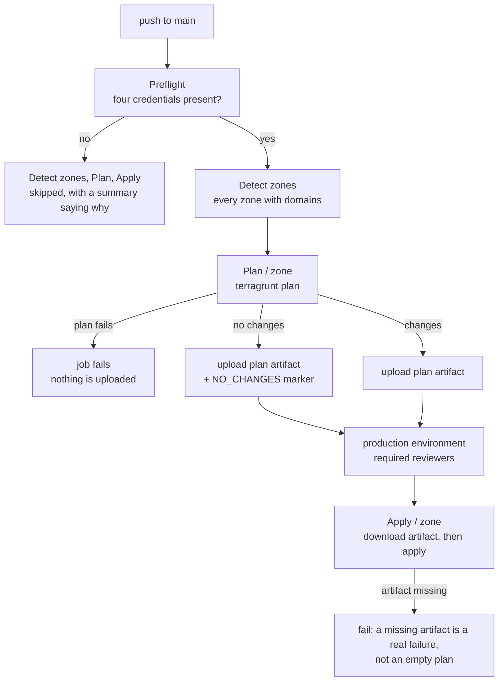

# Pipelines

Six workflows. What each one decides matters more than what it runs, so this
page is organised around the gates: the point in each pipeline where it refuses
to continue, and what would happen if that gate were missing.

Rationale for the design choices lives in [DESIGN_DECISIONS.md](DESIGN_DECISIONS.md);
what is and is not covered by tests is the last section there.

| Workflow | Trigger | Gate |
| --- | --- | --- |
| **Validate** | pull request to `main` | Seven jobs plus `Validate complete`, the single required check. Five of them must report exactly `success`, so a skipped or cancelled job fails the gate rather than passing as one; the per-zone `validate` job is required only when `Detect changed zones` reports `any_changes=true`, which is how a docs-only pull request passes with an empty zone matrix |
| **Deploy** | push to `main` | `Preflight` checks all four credentials are present and skips plan and apply outright when they are not. Apply additionally waits on the `production` environment's reviewers |
| **Security** | pull request, push to `main`, monthly | Trivy misconfiguration scan over `terraform/**` and the workflows |
| **State Operations** | `workflow_dispatch` only | One of `import-domain`, `remove-domain`, `move-domain`, per zone and domain. Never automatic: these rewrite state and have no undo |
| **Provider lock** | monthly, or manual | Opens a pull request when `init -upgrade` resolves a newer provider build, and validates the zones itself — a `GITHUB_TOKEN` pull request triggers no workflows |
| **Tool versions** | monthly, or manual | Same shape, for the Terraform and Terragrunt versions pinned in the `setup-iac` action |

## What a zone directory is made of

A zone directory holds one file that a human writes. Everything Terraform reads
is generated by Terragrunt on each run, which is why the generated files are in
the repository but never edited by hand.

`TG_BACKEND=local` is what lets a pull request run `terragrunt validate` with no
Terraform Cloud organisation and no credentials.

## Deploy: two gates, both of which have been wrong before

Both gates exist because of faults this pipeline shipped:

- Six Deploy runs reported `Apply / <zone>: success` with no credentials at all.
  `plan` had failed, uploaded nothing, and the apply step read the absent
  artifact as "no changes". The download is now mandatory, and the absence of an
  artifact fails the job.
- The credential check came later, so that a fork with no secrets skips the
  pipeline visibly instead of running it into an error.

Two smaller guards hold the same line: the upload uses
`if-no-files-found: error`, so a plan that produced neither a plan file nor a
marker fails at the upload rather than at the download; and applies run
`max-parallel: 1` behind a per-zone concurrency group, so two runs cannot apply
the same zone at once.

## What a pull request actually exercises

Validate covers the module's logic, each zone's configuration, the decision
logic of the plan, apply and state-operation scripts, the moved-block
generator behind `make moves`, the import-block generator behind `make imports`,
the zone detection that builds both matrices, and the workflows' version pins. It does not cover `terragrunt apply`, which has never run in this
repository — the plan and apply steps of Deploy, the artifact hand-off and the
environment approval are only exercised by a push to `main` with credentials
present.

`make mutants` is the other half: it breaks the module 49 ways and checks the
test suite notices. It runs by hand, deliberately — see the design notes.
